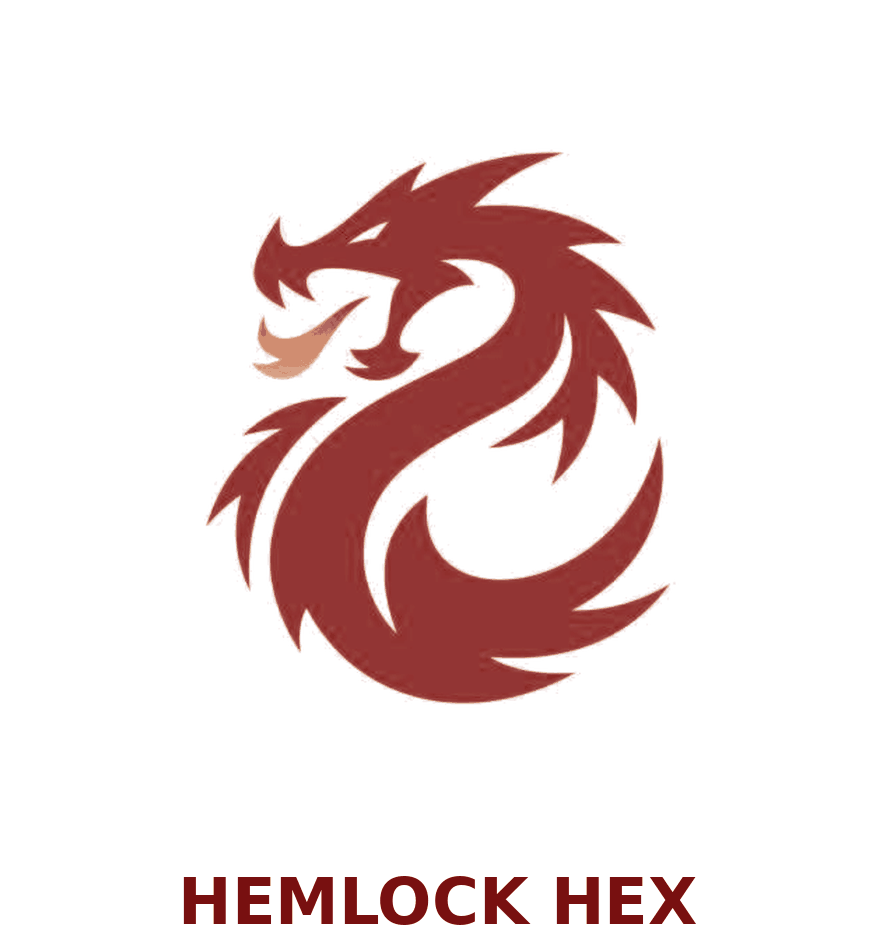

<div align="center">

```
██╗  ██╗███████╗██╗  ██╗
██║  ██║██╔════╝╚██╗██╔╝
███████║█████╗   ╚███╔╝ 
██╔══██║██╔══╝   ██╔██╗ 
██║  ██║███████╗██╔╝ ██╗
╚═╝  ╚═╝╚══════╝╚═╝  ╚═╝
```


<br/>


</div>

---

Hey, I'm **Badar ul nisa**,  first year Cybersecurity student. I'm currently working on a project that I'll be uploading here soon, so stay tuned.

These days I've been learning C++. Boring at first, but honestly? Pretty fun once it clicks. I know what you're thinking  *why is a cyber student learning programming?* Well, in my opinion, programming + cybersecurity is just the better path. Makes sense when you think about it.

So far I've successfully disabled my neighbor's WiFi, done some brute forcing, and dug into forensic decoding. Right now I'm deep into **reverse engineering**  and if you dare call it boring, I beg! pease dont'(😠). It is genuinely thrilling.

If you actually read all of this thank you, truly. You're one of the good ones.

 *Fun fact: my jokes are actually funny, and I can cook better than most. I love Reading (please count it as a skill).*

---

###  Reach Me

<div align="center">

[](mailto:medusaTRI3D2seduceME@outlook.com)
[](mailto:badrulnisakhan@icloud.com)
</div>

###  Socials

<div align="  left">

[](https://discord.gg/https://discord.gg/s7us9SZ7) 
[](https://linkedin.com/in/badar-u-857a4a27) 

</div>

---

<p align="center">
  
</p>

---

 **Hemlock Hex**  is our CTF team name, we have played numerous ctfs under this name and gained certs, vouchers and prizes
one of this includes  **Hack the box**  premium 300$ voucher.

---

### ⚔️

**Languages & OS**


**Forensics & RE Tools**


 
 


**CTF Platforms**

[](https://tryhackme.com/p/Badarulnisa)
[](https://app.hackthebox.com/profile/)
[](https://cyberdefenders.org/)
[](https://picoctf.org/)

---


### Stats:
<br/>

<br/>


---


### Contributions

<div align="center">

<picture>
  <source media="(prefers-color-scheme: dark)" srcset="https://raw.githubusercontent.com/Badarulnisa/Badarulnisa/output/github-contribution-grid-snake-dark.svg">
  
</picture>

</div>

---

<div align="center">

  
